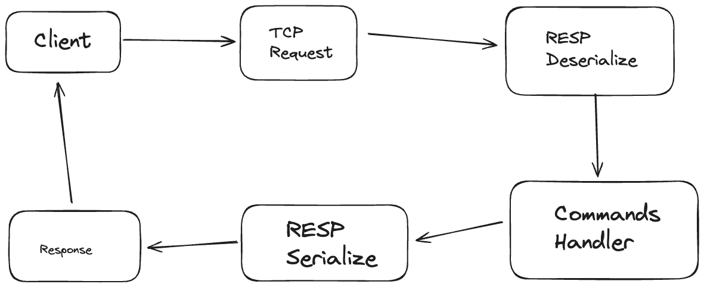

# build-from-scratch
Code solutions to the "Build From Scratch" initiative

# Redis


A Redis clone that allows us to use strings and hashes. The clone uses a parser that can serialize and deserialize RESP (Redis serialization protocol specification). 

This redis clone can handle multiple concurrent connections. 

Data is written to disk using Append Only File (AOF), which is one of the methods redis uses to persist data.

## Links
- Redis strings: https://redis.io/docs/data-types/strings/
- Redis hashes: https://redis.io/docs/data-types/hash
- RESP: https://redis.io/docs/latest/develop/reference/protocol-spec/
- AOF: https://redis.io/docs/latest/operate/oss_and_stack/management/persistence/

## How Redis works
We can store key-value pairs using strings for example. The key will be a string, and the value a serialized object, such as an array, a number, or a boolean
```bash
SET foo bar
```
```bash
GET foo
"bar"
```
Redis recevies these commands though the Redis serialization protocol (RESP). Our `SET` command above will be serialized as:
```bash
*3\r\n$3\r\nset\r\n$3\r\nfoo\r\n$3\r\nbar
```
which can be simplified as
```bash
*3
$3
set
$3
foo
$3
bar
```
where
- `*3` indicates that there are 3 arguments. Therefore we will need to read **6** lines. Each pair of lines represent the type and the size of the object, and the second line represents the value of the object.
- `$3` indicates that the object is a string with a length of 3.

Similarly, the `GET` command will be serialized as:
```bash
*2\r\n$3\r\nget\r\n$3\r\nfoo
```
which can be simplified as
```bash
*2
$3
get
$3
foo
```

## How to run
```bash
go run .
# run redis-cli
redis-cli
127.0.0.1:6376> SET foo bar
OK
127.0.0.1:6376> GET foo
"bar"
127.0.0.1:6376> HSET myhash field1 "Hello"
OK
127.0.0.1:6376> HGET myhash field1
"Hello"
127.0.0.1:6376> HGETALL myhash
1) "field1"
2) "Hello"
```